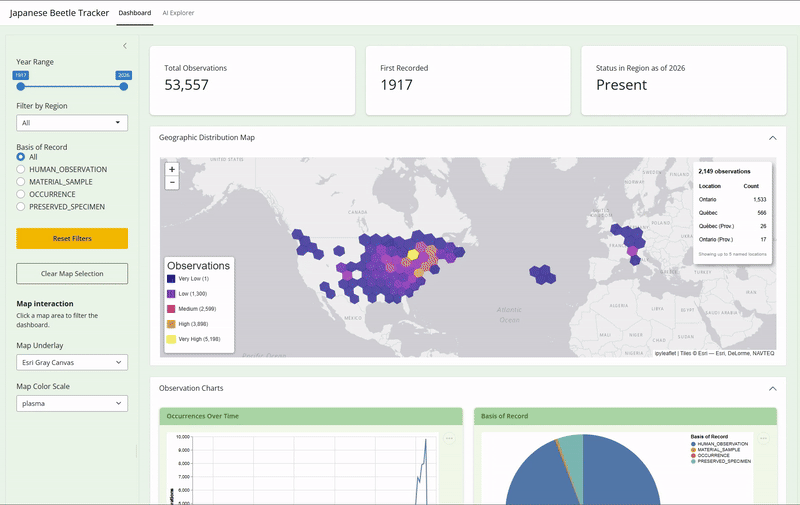

# DSCI-532_2026_21_beetle-tracker

## Japanese Beetle — Invasive Species Tracker

A Python Shiny dashboard for tracking Japanese Beetle observations across the world.

### Shiny App URL

There are 2 builds. The stable build (main) is the official release, and is manually republished when necessary. The preview build (dev) rebuilds automatically on every push to the dev branch. The preview build also functions as the team's live preview, so anyone can see the latest state of the app without running it locally.

[Stable](https://019c9184-1261-a87a-ddfc-1564bfdd2990.share.connect.posit.cloud)

[Preview](https://019c9188-e172-6a48-02c5-6482db896430.share.connect.posit.cloud)

## Demo



## How to Use the Dashboard

### Dashboard Tab

Use the sidebar filters to explore beetle observations:

- **Year Range**: slide to restrict observations to a specific time window
- **Filter by Region**: select a country code to show only observations from that region
- **Basis of Record**: choose the observation type (e.g. `HUMAN_OBSERVATION`, `PRESERVED_SPECIMEN`)
- **Reset Filters**: restores all filters to their default (full dataset) state
- **Map Underlay / Color Scale**: change the map background and hex bin colour scheme

The three summary cards update automatically with every filter change:

- **Total Observations**: count of rows matching the current filters
- **First Recorded**: earliest year with an observation in the filtered data
- **Status in Region**: shows `Present` if any observation falls in the slider's upper year, otherwise `Not Detected`

The map shows observation density using H3 hexagonal bins — darker cells mean more observations. Hover over a cell to see the top 5 locations and their counts.

The four charts below the map show: occurrences over time, breakdown by basis of record, top 10 rights holders, and seasonal observations by month.

### AI Explorer Tab

Type a natural language question about the beetle data (e.g. "how many observations are from the US after 2010?"). The AI will query the dataset and return an answer along with a filtered table and charts. Use the Download CSV button to export the current AI-filtered data.

## Running the App Locally

### 1. Clone the repository

```bash
git clone https://github.com/UBC-MDS/DSCI-532_2026_21_beetle-tracker.git
cd DSCI-532_2026_21_beetle-tracker
```

### 2. Create the conda environment

```bash
conda env create -f environment.yml
```

sketch_png
If the environment already exists, remove it first:

```bash
conda env remove -n dsci532
```

### 3. Activate the environment

```bash
conda activate dsci532
```

### 4. Start the dashboard

```bash
shiny run src/app.py
```

Open the URL provided in the terminal output to view the app in your browser.

## AI Explorer Tab

The **AI Explorer** tab requires an API key to function. The rest of the dashboard works without one.

The easiest (and free) option is a **GitHub Personal Access Token (PAT)**, which you can generate at [github.com/settings/tokens](https://github.com/settings/tokens).

Alternatively, an **Anthropic API key** also works.

### Setting up your API key

Create a file named `.env` in the root of the repository (next to `environment.yml`):

```text
DSCI-532_2026_21_beetle-tracker/
├── .env               <- create this file
├── environment.yml
├── src/
...
```

Add one of the following to the `.env` file:

```bash
# Option 1: GitHub PAT (free)
GITHUB_PAT=your_github_pat_here

# Option 2: Anthropic API key
ANTHROPIC_API_KEY=your_anthropic_key_here
```

If both are present, the GitHub PAT takes priority. The `.env` file is listed in `.gitignore` and will not be committed.

## License

This project is licensed under the terms of the [LICENSE](LICENSE) file.

## Contributors

See [CONTRIBUTING.md](CONTRIBUTING.md) for contribution guidelines.
