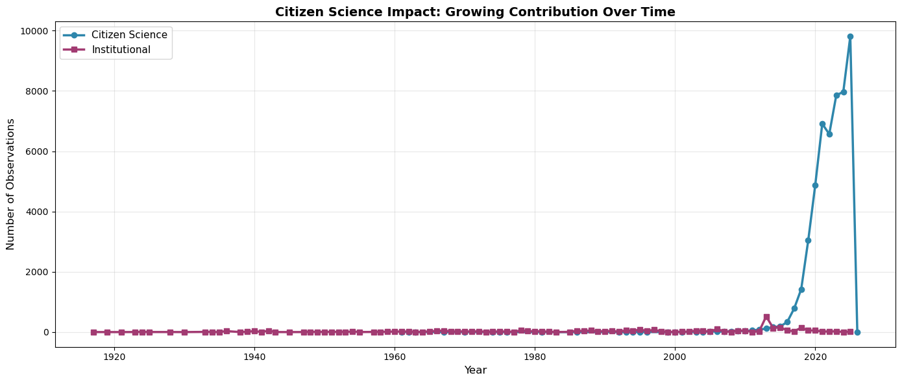
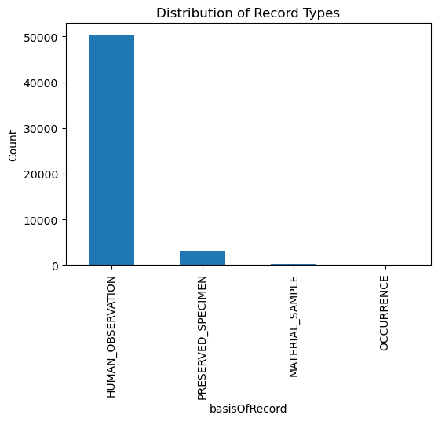

## Section 1: Motivation and Purpose

Invasive species, as a whole, are estimated to have cost countries up to 12% of gross domestic product in costs (Marbuah et al., 2014). Additionally, the problem is getting worse; there has been more harmful impacts of invasive species with the increase in globalization and interconnectivity (Mooney and Hobbes, 2000). However, governments can reduce the economic and environmental impacts of invasive species through mitigation techniques (Hanley and Roberts 2019). Key to mitigation efforts is thorough data and monitoring, and through citizen science efforts and innovations, this can be much more easily achieved. Citizen science sites like iNaturalist (<https://www.inaturalist.org/>) allow users to submit photos of plants and animals, which can then be identified to species by experts. In the case of invasive insects, this can be very beneficial; a wide array of people submitting photos, attached to location data, can detect the presence of invasive insects more rapidly. This allows for faster response to the problem. We propose a dashboard which focuses on the Japanese beetle, Popillia japonica, an invasive insect species. In British Columbia, if the Japanese beetle were to establish a population, it could cost the province up to fourteen point five million dollars annually in crop damages. Our dashboard is focused on targeting British Columbians, informing them about not only Japanese beetle populations and how they have spread, but also their ability to have an impact through citizen science methods.

## Section 2: Description of the Data

The dataset we have chosen to use for this dashboard comes from the Global Biodiversity Information Facility, which provides open-source datasets and occurrence records from a variety of sources, including iNaturalist. By searching for occurrences of ‘Popillia japonica’, we get a table with 87,719 occurrences, but by filtering for those columns with all variables present, we get 53,557 occurrences. Variables included in the dashboard will be: Country or area, Coordinates, Event date, and Basis of record. Coordinates will allow us to show a map of Japanese beetle distribution, worldwide. We can associate this with a country or area to identify and list hotspots, or areas of concern. Event date will be used to track occurrence data across time. Finally, basis of record shows whether the record is human observation (citizen science data), preserved specimen (collection data), or general ‘occurrence’.

## Section 3: Research Questions and Usage Scenarios

### Usage scenario

John Smith manages a Turf farm in British Columbia. He is concerned about the impacts of invasive species on his farm. He’d like to be able to visually learn more about the insect which most threatens his business, the Japanese beetle. He wants to see how, when, and where it has spread so far.

John logs onto the dashboard for an updated species distribution map. He is curious about how long it took from the time of the first observation on the East coast of North America, to full infestation. He is able to set a range of time, starting from the first occurrence, and visualize on the map how a population was established and began to grow. He is reassured by the new information, and feels more informed.

### User stories

As a frequent iNaturalist user, I want to see the impacts of my, and my fellow citizen scientists, observations, so I filter observations by basis of record.

As someone living abroad, I just found out about the Japanese beetle, and I want to see if it is present near me, and if so, where. I can filter by continent, and manipulate the map, to see occurrences near me.
As a policy maker in government who is considering funding an awareness campaign in British Columbia, I want to know if the Japanese beetle has been found near my municipality, and if so, when.

## Section 4: Exploratory Data Analysis

A complete EDA can be found in `notebooks/eda_analysis.ipynb`

### Selected User Story
This EDA focuses on **User Story**: "As a frequent iNaturalist user, I want to see the impacts of my, and my fellow citizen scientists, observations, so I filter observations by basis of record."

### Key Findings

Some notable findings from the dataset exploration included:

1. **Citizen science dominance**: Community scientists contribute 94.1% of all observations (50,419 records), outnumbering institutional collections by 17:1. This confirms that filtering by `basisOfRecord` will effectively highlight citizen science impact.

2. **Explosive growth trend**: Citizen science observations increased 4,057% from 2015 to 2023 (189 → 7,857 records), while institutional contributions decreased (157 → 28). This dramatic growth validates the importance of showcasing citizen scientist contributions over time.

3. **Data quality for filtering**: The `basisOfRecord` field is 99.9% populated with clear distinction between HUMAN_OBSERVATION and PRESERVED_SPECIMEN categories, making it reliable for dashboard filtering functionality.

4. **iNaturalist as primary source**: 93.1% of all observations come specifically from iNaturalist (49,878 records), demonstrating that the platform is the dominant data source and confirming the relevance of this user story.

These findings confirm that the dataset fully supports the selected user story and can effectively power dashboard features that allow citizen scientists to see their collective impact on Japanese beetle monitoring.

### Visualizations

#### Figure 1: Citizen Science Impact Over Time

**What this shows:** Citizen science observations increased from 189 in 2015 to 7,857 in 2023 (4,057% growth), while institutional observations decreased from 157 to 28.

**How this supports decision-making:** By comparing 2015 vs 2023, iNaturalist users can see their collective impact has grown 42x, with a current 280:1 ratio over institutions, validating the need to filter and showcase citizen science contributions.

#### Figure 2: Data Source Breakdown  

**What this shows:** 94.1% HUMAN_OBSERVATION vs 5.5% PRESERVED_SPECIMEN.

**How this supports decision-making:** The 17:1 ratio confirms filtering by `basisOfRecord` will reliably separate citizen science from institutional data.

## Section 5: App Sketch & Description

### Sketch

| Sketch 1 | Sketch 2 |
|:-:|:-:|
|  |  |
| *First draft, brainstorming ideas* | *Second draft, more polished* |

### Description

When the user first opens the dashboard, they will see input controls on the left side, and outputs and plots on the right side. The left sidebar will contain filter controls such as date range, region selectors, and basis of record radio buttons. On the right side, the top row will be summary statistics, followed by a large interactive map in the middle, and then several plots and charts at the bottom. The dashboard will be highly reactive and interactive. The user will be able to make changes on the filter controls and see immediate live updates on the right side.

Here are at least 9 components that are planned for the dashboard:

1. Date range slider: Restrict data to use only observations within the date range (default to entire date range)
2. Region dropdown selector: Restrict data to use only observations within a particular region (default to all regions)
3. Basis of record radio button: Allow the user to isolate different categories of observations, such as human observations or preserved specimens (default to all)
4. Value box: Summary stat of total observations (Based on input filters, how many recorded observations are there?)
5. Value box: Summary stat of first occurrence year (Based on input filters, what year was the first observation?)
6. Value box: Summary stat of status of invasive species (Based on input filters, is there a current presence of the invasive species?)
7. Interactive map: The map will show observation density of the invasive species
8. Time series plot: A plot showing the increasing or decreasing number of observations over time
9. Distribution plot: A plot showing the distribution of Basis of Record (what percentage of observations are human-observed, etc.)

Based on the above sketches and component descriptions, we have come up with this initial Shiny dashboard skeleton, which can be run by following the Readme instructions on our GitHub page.

*Initial Shiny dashboard skeleton*

## Citations

Invasive Species Centre. (2024, September 11). Japanese Beetle – Invasive Species Centre. <https://www.invasivespeciescentre.ca/invasive-species/meet-the-species/invasive-insects/japanese-beetle/>

Marbuah G, Gren I-M, McKie B. Economics of Harmful Invasive Species: A Review. Diversity. 2014; 6(3):500-523. <https://doi.org/10.3390/d6030500>

Mooney, H., & Hobbes, R. (2000). Invasive species in a changing world. Island Press. <https://books.google.ca/books?hl=en&lr=&id=hCoJiTo7I3wC&oi=fnd&pg=PP13&dq=invasive+species+numbers&ots=OPrhsXBvHv&sig=BIhw8pT9fS7jEW5My3-D-rCkOYg#v=onepage&q=invasive%20species%20numbers&f=false>
Hanley, Nicholas  and Roberts, Michaela (2019) The economic benefits of invasive species management. People and Nature, 1(2), pp. 124-137. (doi: 10.1002/pan3.31)

Dataset citation:
GBIF.org (13 February 2026) GBIF Occurrence Download <https://doi.org/10.15468/dl.fqtxjx>
